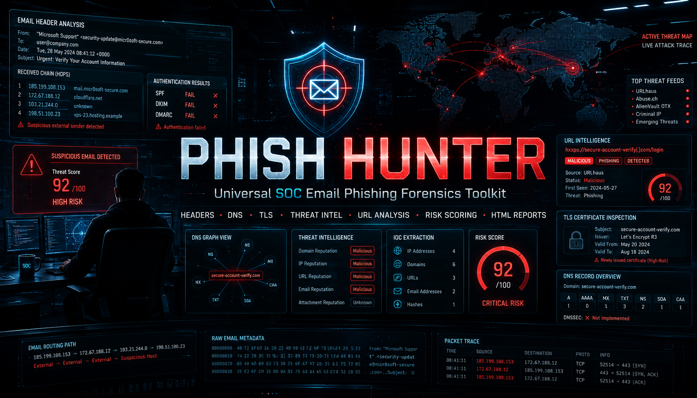

# PhishHunter

<div align="center">



**Universal SOC Email Phishing Forensics Tool**

Headers • DNS • TLS Certificates • Threat intel • Risk scoring

[](https://www.python.org)
[](#license)
[]()
[]()
[]()

</div>

---

## Overview

**PhishHunter** is a self-contained Python CLI tool for SOC analysts and security professionals to perform end-to-end forensic analysis of suspected phishing emails. It combines email header forensics, DNS record analysis, TLS certificate validation, URL/attachment intelligence, and weighted risk scoring into a single command-line interface — generating analyst-grade JSON and HTML reports.

The tool is designed to run on Kali Linux and any Unix-like system with **Python 3.10 or higher** and **zero mandatory external dependencies** — the entire pipeline uses Python's standard library, plus optional free public APIs that require no registration.

---

## Table of Contents

1. [Key Features](#key-features)
2. [Use Cases](#use-cases)
3. [Requirements](#requirements)
4. [Installation](#installation)
5. [Quick Start](#quick-start)
6. [Detailed Usage](#detailed-usage)
7. [Command-Line Reference](#command-line-reference)
8. [Output Reports](#output-reports)
9. [Architecture](#architecture)
10. [Free Public Sources Used](#free-public-sources-used)
11. [Sample Output](#sample-output)
12. [Limitations](#limitations)
13. [Roadmap](#roadmap)
14. [Contributing](#contributing)
15. [Author](#author)
16. [License](#license)
17. [Acknowledgements](#acknowledgements)

---

## Key Features

### Email Forensics
- Parse `.eml` files end-to-end — full headers, multipart bodies, attachments
- **Received-chain analysis** — trace the email's path through every hop bottom-up
- **Originating IP extraction** — identify the email's true origin server
- **Authentication interpretation** — read SPF, DKIM, and DMARC results from headers
- **Spoofing heuristics** — display-name vs local-part mismatch, Reply-To anomaly, Return-Path mismatch
- **Brand impersonation detection** — flags emails claiming to be from Microsoft, Google, banks, etc. but sent from unrelated domains

### DNS Record Forensics
- Comprehensive DNS lookups via **DNS-over-HTTPS** — Cloudflare `1.1.1.1` (primary) and Google `8.8.8.8` (fallback)
- All record types: **A, AAAA, MX, TXT, NS, CNAME, SOA, PTR, SRV, CAA**
- **Email authentication policy extraction** — parses SPF strength (strict/soft/permissive), DMARC policy (`p=none|quarantine|reject`)
- **DKIM selector probing** — tests common selectors (`default`, `google`, `selector1`, `k1`, `s1`, `mail`, etc.)
- **Reverse DNS for sender IPs** — validates PTR records against the claimed sender domain

### TLS / SSL Certificate Forensics
- **Live certificate retrieval** via raw socket on port 443
- Parses Subject, Issuer, validity dates, Subject Alternative Names (SANs), serial number
- **Hostname-match validation** against the certificate's CN/SAN
- **Days-until-expiry calculation** with critical/warning thresholds
- **Certificate Transparency** lookup via [crt.sh](https://crt.sh) — finds historical certificates and lookalike domains
- **Optional SSL Labs integration** for grade lookup (slow, requires `--ssllabs` flag)

### URL & Domain Intelligence
- URL extraction from both HTML and plain-text email bodies
- **URLhaus** reputation lookup (abuse.ch, free)
- **Optional VirusTotal** integration (requires free API key)
- **RDAP** domain age check — flags newly registered domains (`< 30 days`)
- Heuristics for typosquatting, homograph attacks, suspicious TLDs (`.xyz`, `.top`, `.click`, etc.)

### Attachment Analysis
- **SHA-256 and MD5** hash calculation for each attachment
- **Shannon entropy** — detects packed/encrypted/compressed payloads
- **Risky extension detection** — `.exe`, `.scr`, `.iso`, `.lnk`, `.hta`, macro-enabled Office docs, and more
- **Password-protected archive detection** (ZIP files)

### Risk Scoring & Reporting
- **Weighted 0–100 risk score** combining header forensics, URL reputation, attachment risk, DNS auth posture, TLS findings, brand impersonation, and body keyword density
- **Five-level risk classification**: `MINIMAL` → `LOW` → `MEDIUM` → `HIGH` → `CRITICAL`
- **Defanged IOC output** — URLs and IPs rendered analyst-safe (`hxxps://evil[.]com`)
- **JSON report** — machine-readable for SOAR integration
- **HTML report** — dark-themed analyst dashboard with risk meter, authentication tables, DNS records, TLS findings, and curated investigation tool links
- **Batch processing** — analyze entire directories of `.eml` files in one run
- **Built-in self-test** — validates the pipeline against an embedded phishing sample

---

## Use Cases

- **SOC Tier 1/2 analysts** triaging reported phishing emails
- **Incident responders** investigating Business Email Compromise (BEC) cases
- **Threat intelligence teams** extracting IOCs from phishing campaigns
- **Security researchers** studying phishing infrastructure (NS pivots, certificate transparency)
- **Cybersecurity educators and students** learning email forensics hands-on
- **Personal users** verifying suspicious emails before clicking

> **Note**: PhishHunter performs **static analysis only**. It does not detonate URLs or attachments. For dynamic analysis, use a dedicated sandbox like Any.Run, Hybrid Analysis, or Joe Sandbox.

---

## Requirements

| Requirement | Version | Notes |
|---|---|---|
| **Python** | 3.10 or higher | Uses modern type hints, dataclasses |
| **Operating System** | Linux, macOS, WSL on Windows | Tested on Kali Linux 2024.x / 2025.x |
| **Network** | Internet access | Optional — tool works offline with `--no-dns --no-tls` |
| **External libraries** | None required | Pure Python stdlib |
| **Optional: VirusTotal API key** | Free tier | Enables URL/file reputation via VirusTotal |

---

## Installation

### Option 1 — Clone from GitHub (Recommended)

```bash
git clone https://github.com/shahbaaz-devsec/phishhunter.git
cd phishhunter
chmod +x phishhunter.py
python3 phishhunter.py --self-test
```

### Option 2 — Direct Download

```bash
wget https://raw.githubusercontent.com/shahbaaz-devsec/phishhunter/main/phishhunter.py
chmod +x phishhunter.py
python3 phishhunter.py --self-test
```

### Option 3 — System-Wide Install (Optional)

After cloning, install as a system command:

```bash
sudo cp phishhunter.py /usr/local/bin/phishhunter
sudo chmod +x /usr/local/bin/phishhunter

# Now usable from anywhere
phishhunter --self-test
phishhunter suspicious.eml
```

---

## Quick Start

```bash
# 1. Run the built-in self-test (validates the pipeline)
python3 phishhunter.py --self-test

# 2. Analyze a suspicious email
python3 phishhunter.py suspicious.eml

# 3. Open the generated HTML report
xdg-open phish-hunter-reports/suspicious.html
```

---

## Detailed Usage

### Analyze a Single Email

```bash
python3 phishhunter.py path/to/email.eml
```

Output:
- `./phish-hunter-reports/email.json` — full machine-readable forensic data
- `./phish-hunter-reports/email.html` — analyst-grade visual report
- `./phish-hunter-reports/email_attachments/` — extracted attachments for triage

### Batch-Analyze a Directory

```bash
python3 phishhunter.py --batch ./phishing_samples/ --format html
```

Processes every `.eml` and `.msg` file in the directory, generates a report for each, and prints a summary table at the end.

### Faster Mode (No DNS, No TLS)

For air-gapped environments or rapid bulk triage:

```bash
python3 phishhunter.py email.eml --no-dns --no-tls
```

### With VirusTotal Integration

```bash
python3 phishhunter.py email.eml --vt-key YOUR_FREE_VT_API_KEY
```

Get a free key at [virustotal.com](https://www.virustotal.com).

### Maximum Depth (Slow — Includes SSL Labs)

```bash
python3 phishhunter.py email.eml --ssllabs
```

Adds an SSL Labs grade lookup per sender domain. Adds ~60 seconds per domain.

---

## Command-Line Reference

```
usage: phishhunter [-h] [--batch DIR] [--output OUTPUT] [--format {json,html,both}]
                   [--vt-key KEY] [--timeout TIMEOUT] [--no-dns] [--no-dkim-probe]
                   [--no-tls] [--ssllabs] [--self-test] [--quiet] [--version]
                   [file]

positional arguments:
  file                       Path to a .eml (or .msg) email file

options:
  -h, --help                 Show help message and exit
  --batch DIR                Analyse all .eml files in a directory
  --output, -o OUTPUT        Output directory (default: ./phish-hunter-reports)
  --format, -f {json,html,both}
                             Report format(s) (default: both)
  --vt-key KEY               VirusTotal API key (optional)
  --timeout TIMEOUT          HTTP request timeout in seconds (default: 15)
  --no-dns                   Disable DNS forensics (faster, less complete)
  --no-dkim-probe            Skip DKIM selector probing
  --no-tls                   Disable TLS certificate forensics
  --ssllabs                  Run SSL Labs grade lookup (slow ~60s per domain)
  --self-test                Run built-in self-validation test
  --quiet, -q                Suppress banner and verbose output
  --version, -V              Show version
```

---

## Output Reports

### JSON Report
Complete forensic data structure including:
- Email metadata and headers
- All extracted URLs with reputation data
- All attachments with hashes and entropy
- DNS records for sender and URL domains
- TLS certificate details and Certificate Transparency data
- Spoofing and brand impersonation indicators
- Final weighted risk score and contributing factors

Ideal for SOAR ingestion, SIEM enrichment, or further automated processing.

### HTML Report
Visual analyst dashboard with:
- Risk score gauge
- Header analysis table
- Received-hops trace
- DNS forensics per investigated domain
- TLS certificate breakdown with hostname-match validation
- URL analysis table with VirusTotal and URLhaus columns
- Attachment hashes and entropy
- Curated investigation tool links for further pivoting

Designed for inclusion in incident tickets and stakeholder communications.

---

## Architecture

```
┌─────────────────────────────────────────────────────────────┐
│                     PhishHunter Pipeline                    │
├─────────────────────────────────────────────────────────────┤
│                                                             │
│  Input: .eml / .msg file                                    │
│       │                                                     │
│       ▼                                                     │
│  ┌─────────────┐   Parse headers, bodies, attachments       │
│  │ EmailParser │                                            │
│  └─────────────┘                                            │
│       │                                                     │
│       ▼                                                     │
│  ┌──────────────────┐   SPF/DKIM/DMARC, Received hops,      │
│  │ HeaderForensics  │   spoof indicators, originating IP    │
│  └──────────────────┘                                       │
│       │                                                     │
│       ▼                                                     │
│  ┌──────────────┐    Extract URLs from HTML and text        │
│  │ URLExtractor │                                           │
│  └──────────────┘                                           │
│       │                                                     │
│       ▼                                                     │
│  ┌─────────────┐   URLhaus + optional VirusTotal +          │
│  │ URLChecker  │   RDAP domain age + heuristics             │
│  └─────────────┘                                            │
│       │                                                     │
│       ▼                                                     │
│  ┌──────────────────┐  SHA-256/MD5 hashes, Shannon entropy, │
│  │ AttachmentTriage │  risky extension detection            │
│  └──────────────────┘                                       │
│       │                                                     │
│       ▼                                                     │
│  ┌─────────────┐    A/AAAA/MX/TXT/NS/CNAME/SOA/PTR/         │
│  │ DNSAnalyzer │    SRV/CAA + SPF/DKIM/DMARC parsing        │
│  └─────────────┘    via Cloudflare + Google DoH             │
│       │                                                     │
│       ▼                                                     │
│  ┌───────────────────────┐ Live cert + crt.sh transparency  │
│  │ TLSCertificateAnalyzer│ + optional SSL Labs grade        │
│  └───────────────────────┘                                  │
│       │                                                     │
│       ▼                                                     │
│  ┌─────────────────┐    Weighted risk scoring across        │
│  │ PhishingScorer  │    7 dimensions + level classification │
│  └─────────────────┘                                        │
│       │                                                     │
│       ▼                                                     │
│  ┌──────────────────┐    JSON + HTML reports                │
│  │ ReportGenerator  │                                       │
│  └──────────────────┘                                       │
│                                                             │
└─────────────────────────────────────────────────────────────┘
```

---

## Free Public Sources Used

All external services are free and require **no API key** (except VirusTotal, which is optional):

| Service | Purpose | API Key Required |
|---|---|---|
| **Cloudflare DNS over HTTPS** | DNS record lookups | No |
| **Google DNS over HTTPS** | DNS fallback | No |
| **URLhaus (abuse.ch)** | URL reputation | No |
| **RDAP.org** | Domain age / WHOIS replacement | No |
| **crt.sh** | Certificate Transparency logs | No |
| **SSL Labs** | TLS grade lookup | No (rate-limited) |
| **VirusTotal** | URL/file reputation | **Optional** (free tier) |

---

## Sample Output

```
======================================================================
  PhishHunter — Analysing: suspicious_microsoft_alert.eml
======================================================================

┌─ EMAIL FORENSICS ────────────────────────────────────────────────────┐
  Risk Score:     78.5/100 (CRITICAL)
  From:           "Microsoft Security" <support@microsoft-secure.xyz>
  Subject:        URGENT: Your account has been suspended
  Originating IP: 185.220.101.45
  SPF / DKIM / DMARC:  fail / none / fail
  URLs:           3 (2 suspicious)
  Attachments:    1 (1 suspicious)

┌─ DNS FORENSICS  (3 domains queried) ─────────────────────────────────┐
  ● microsoft-secure.xyz  (auth strength: 5/100)
      A         : 185.220.101.45
      MX        : 10 mail.cheaphost.ru
      SPF       : MISSING
      DMARC     : MISSING
      DKIM      : 0 selectors found
      ⚠ No SPF record — domain easily spoofable
      ⚠ No DMARC record — receivers cannot verify policy

┌─ TLS / CERT FORENSICS  (2 domains) ──────────────────────────────────┐
  ● microsoft-secure.xyz  [ok]
      Subject   : CN=microsoft-secure.xyz
      Issuer    : Let's Encrypt
      Expires   : in 89 days
      Hostname  : matches
      crt.sh    : 14 certificates, 12 unique names

  🎭 Brand Impersonation Detected:
    - Brand impersonation: display name claims 'microsoft' but sender
      domain is microsoft-secure.xyz

  🚩 Key Indicators:
    - Authentication failures: 2
    - Display name 'Microsoft Security' does not match local part 'support'
    - DNS: sender domain microsoft-secure.xyz has no SPF record
    - DNS: sender domain microsoft-secure.xyz has no DMARC policy
    - TLS: brand-looking domain microsoft-secure.xyz uses free Let's Encrypt
      cert — common phishing pattern
```

---

## Limitations

PhishHunter is designed for **static analysis** and has these intentional limitations:

- **No URL detonation**: URLs are checked against reputation databases but never visited. For dynamic analysis, use Any.Run, Hybrid Analysis, or URLScan.io manually.
- **No malware sandboxing**: Attachments are hashed and analyzed statically. For behavioral analysis, submit to a dedicated sandbox.
- **No real-time email gateway integration**: This is an offline analysis tool. Integration with Microsoft 365, Proofpoint, or Mimecast would require additional connectors.
- **No SOAR orchestration**: The JSON output is SOAR-compatible, but PhishHunter itself does not orchestrate response actions.
- **DKIM probing is selector-based**: If a domain uses an uncommon DKIM selector, the tool may not detect it. The probe covers a curated list of common selectors.
- **SSL Labs is rate-limited**: The free SSL Labs API has strict rate limits; bulk SSL Labs use is not practical.
- **Limited `.msg` parsing**: While the CLI accepts `.msg` files, full Outlook MSG format parsing requires additional dependencies. Convert MSG to EML before analysis for best results.

---

## Roadmap

Planned enhancements (in no particular order):

- [ ] `.msg` file support via `extract-msg` integration
- [ ] STIX 2.1 IOC export for threat intel sharing
- [ ] MISP integration for IOC submission
- [ ] Cisco Talos and IBM X-Force Exchange reputation integration
- [ ] AbuseIPDB integration for sender-IP reputation
- [ ] Configurable scoring weights via YAML config file
- [ ] Email-attachment macro extraction via `oletools`
- [ ] PDF malicious-object detection via `pdfid` / `pdf-parser`
- [ ] Optional rich-terminal interface using `rich` library
- [ ] Containerized version (Docker)
- [ ] Bulk report aggregation and trending dashboard

Contributions toward any of these are welcome — see [Contributing](#contributing).

---

## Contributing

Contributions, bug reports, and feature requests are welcome.

### Reporting Bugs

When opening an issue, please include:
- PhishHunter version (`python3 phishhunter.py --version`)
- Python version (`python3 --version`)
- Operating system and version
- Complete command used
- Full error output or unexpected behavior
- Sanitized email sample if applicable (remove all PII)

### Submitting Pull Requests

1. Fork the repository
2. Create a feature branch (`git checkout -b feature/your-feature`)
3. Make changes with clear commit messages
4. Test against the self-test (`python3 phishhunter.py --self-test`)
5. Open a pull request with a description of the changes

---

## Author

**Mohammad Shahbaaz Ahmed**
Cybersecurity & Automation Engineer

- **GitHub**: [github.com/shahbaaz-devsec](https://github.com/shahbaaz-devsec)
- **LinkedIn**: [linkedin.com/in/mohammad-shahbaaz-ahmed-138a423bb](https://www.linkedin.com/in/mohammad-shahbaaz-ahmed-138a423bb)

Currently pursuing:
- Executive Post Graduate Certification in **Cybersecurity & Ethical Hacking** — IIT Roorkee (via Intellipaat)
- Global MBA in **Cybersecurity Management** — SSBM Geneva (via Intellipaat)

Professional background spans backend automation, AI workflow engineering, and payroll systems integration — now transitioning into security operations with a focus on automation-augmented SOC workflows.

---

## License

This project is provided for **educational and authorised SOC use only**.

You are permitted to:
- Use, study, and modify the code for personal and educational purposes
- Run the tool on emails you legally own or have authorization to analyze
- Use the tool in security training, CTFs, and academic research

You may **not**:
- Use this tool to harass, surveil, or attack others
- Analyze emails you do not have legal authorization to access
- Sell or rebrand this tool without the author's written permission

The author assumes no liability for misuse. Use at your own risk and within your jurisdiction's applicable laws.

---

## Acknowledgements

This tool is made possible by these free public services and the communities that maintain them:

- **abuse.ch** — for [URLhaus](https://urlhaus.abuse.ch) and threat intelligence sharing
- **Cloudflare** — for free public DNS-over-HTTPS at `1.1.1.1`
- **Google Public DNS** — for free public DNS-over-HTTPS at `8.8.8.8`
- **Sectigo** — for the [crt.sh](https://crt.sh) Certificate Transparency search
- **Qualys** — for the [SSL Labs](https://www.ssllabs.com) server test API
- **VirusTotal** — for the free reputation API
- **RDAP.org** — for the modern WHOIS replacement protocol
- **MXToolbox**, **EasyDMARC**, and the broader email-security community for documentation and standards

---

<div align="center">

**PhishHunter v1.0** — *Built one phishing email at a time.*

Made with care by [Mohammad Shahbaaz Ahmed](https://github.com/shahbaaz-devsec)

⭐ If this tool helped you, consider giving the repo a star

</div>
